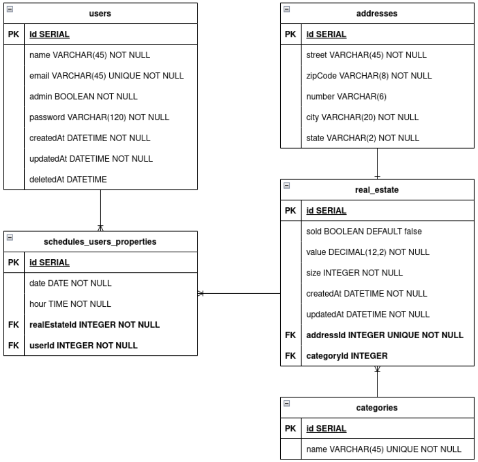

#  KImóveis 

## 1 - Sobre

 KiMoveis e se trata de um serviço back-end responsável por gerenciar uma imobiliária.

A aplicação possui verificações de usuários, permissões para cadastro de novos imóveis ou agendamento de visitas de usuários da aplicação à um imóvel.

---

## 2 - Tecnologias

Um pouco das tecnologias que foram utilizadas no projeto: 

- [NodeJS](https://nodejs.org/en/)
- [Express](https://expressjs.com/pt-br/)
- [TypeScript](https://www.typescriptlang.org/)
- [PostgreSQL](https://www.postgresql.org/)
- [TypeORM](https://typeorm.io/)
- [Zod](https://zod.dev/?id=table-of-contents)
- [Bcryptjs](https://www.npmjs.com/package/bcrypt)

## 3 - Diagrama 

Diagrama da API definindo as relações entre as tabelas do banco de dados.



---

## 4 - Instalação e uso

### Requisitos:
- [NodeJS](https://nodejs.org/en/)
- [Npm](https://www.npmjs.com) ou [yarn](https://yarnpkg.com)
- Banco de dados [PostgreSQL](https://www.postgresql.org)

Clone o projeto em sua máquina e instale as dependências com o comando:

```shell
yarn ou npm install
```

Em seguida, crie um arquivo **.env**, copiando o formato do arquivo **.env.example**:

```
env.example -> .env
```

Configure as variáveis de ambiente com suas credenciais do Postgres e uma nova database da sua escolha.

Execute as migrations com o comando:

```
yarn typeorm migration:run -d src/data-source.ts

ou

npm run typeorm migration:run -d src/data-source.ts
```

Para rodar o servidor localmente: 

```
yarn dev ou npm run dev
```
#### As requisições podem ser testadas em programas como o [Insomnia](https://insomnia.rest/download), [Postman](https://www.postman.com), etc!
---

### Você pode encontrar a documentação com esse EndPoint em seu Browser: 
## /api/doc
